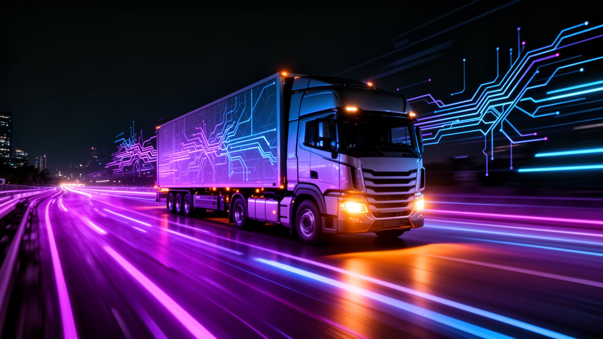

# LOGISTIK // AI Digital Twin Command Center

> A hyper-optimized, Bauhaus-inspired operating system for global supply chains and logistics networks.

LOGISTIK maps the chaos of global shipping into a strict, brutalist, and intensely functional geometric grid. It operates as a full-stack **Supply Chain Command Center** equipped with predictive modeling, autonomous failover systems, and live weather telemetry logic.

 *(Example Hero Representation)*

## 📐 The Bauhaus Philosophy (Form Follows Freight)

This application strictly rejects decorative fluff, gradients, and soft UI tropes like glassmorphism. It is built strictly on **Bauhaus architectural principles**:
*   **Geometric Logic:** Pure rectangular layouts, zero border radii (`rounded-none`), and 2px thick functional borders.
*   **Primary Colors Only:** The interface restricts itself to absolute monochrome (Pitch Black, Off-White) explicitly cut with stark Primary Yellow, Racing Red, and Vibrant Blue.
*   **Maximum Data Density:** Typographical hierarchies rely on *Space Grotesk* for massive, raw system outputs and *Inter* for critical transit data.

---

## ⚡ Core Command Modules

### 1. 🌐 Global Network Top-Down (Dashboard)
The core terminal interface. Monitors real-time transit telemetry, automated re-routing logic, and deep-tier IoT disruption data (e.g., container kinetic shock drops, cold-chain temperature deviations).

### 2. 📦 Live Shipment Registry
Actionable tracking grid for thousands of TEUs (Twenty-foot Equivalent Units) moving across Air, Road, Sea, and Rail nodes. 

### 3. ⛈️ Weather Intelligence
Maps live meteorological models (e.g., cyclones, sandstorms, blizzards) directly against fleet coordinates. A geometric radar interface simulates weather-driven ETA drifts and enables preemptive AI rerouting commands.

### 4. 🕸️ Deep-Tier Supply Web (Inventory)
Visualizes multi-tier supplier fragility. Tracks Tier 3 (Raw Materials) → Tier 2 (Sub-assemblies) → Tier 1 (Components) → Final Production. When a geopolitical or seismic failure occurs at Tier 3, the platform highlights downstream starvation and enables an instant AI Failover rerouting action.

### 5. 🌍 ESG & Carbon Audit
Tracks the real-time Carbon (Scope 3) implications of transit routes. Features an **AI Carbon Shift Protocol** that empowers users to pull thousands of assets from the diesel trucking grid into net-zero electric rail systems, instantly logging the CO2 tonnage offset in an immutable ledger.

### 6. 💹 Market Intelligence 
Predictive neural forecasting of spot-freight transit prices. Recommends "BUY NOW" or "WAIT" directives based on historical saturation algorithms, and features actual interactive carrier spot-bidding for Maersk, Evergreen, and MSC.

---

## 🛠 Tech Stack Stack
*   **Frontend**: React (Vite) + TypeScript
*   **Styling**: Tailwind CSS (Custom customized Token architecture)
*   **Motion**: Framer Motion (Industrial UI Animations)
*   **Charting**: Recharts (Data Visualization)
*   **Backend**: Supabase (PostgreSQL / Auth)
*   **Icons**: Lucide React

## 🚀 Deployment

1. **Install Dependencies**
```bash
npm install
```

2. **Environment Configuration**  
Create a `.env.local` connected to your Supabase instance:
```env
NEXT_PUBLIC_SUPABASE_URL=your_supabase_url
NEXT_PUBLIC_SUPABASE_PUBLISHABLE_KEY=your_supabase_anon_key
```

3. **Initialize the OS**
```bash
npm run dev
```
*System will launch violently at `localhost:8080`*

---
**DESIGNED FOR FLEETS THAT CANNOT AFFORD DELAYS.**
